# Deadline App
Dongyu Jiang

## Github Link

https://github.com/Hengmii/Deadline


## Overview 

This project introduces an Android application named "Deadline," developed using the Kotlin programming language. The primary motivation behind creating Deadline App stems from my personal need for an efficient tool to track the progress of my academic tasks. As a student, I have constantly been juggling multiple tasks and projects, each with their own unique deadlines. Managing and remembering these various timelines and keeping track of progress had become a daunting task. I required a simple yet effective tool that could not only record my academic tasks but also track their progress against their deadlines, which led me to the design and development of "Deadline."

The purpose of Deadline App extends beyond mere task recording. It is centered around facilitating an effective task management system, primarily focusing on calculating and displaying the remaining time for each task. This method serves as a constant reminder of the time left for task completion, aiding in efficient time management and allocation across various activities.

Previously, I used the Reminders app on my iPhone to track my deadlines. While this was a straightforward way to remember tasks, it functioned more like a static record book than an active assistant. It merely held onto the dates and details of my various deadlines without a strong alerting function. Recognizing this limitation, I envisioned developing my own application that could effectively and proactively assist in managing my schedules.

Although my initial motivation for Deadline App was personal, the potential user base for the application is broad. It can cater to the needs of anyone seeking an effective task management tool, ranging from fellow students managing academic tasks to professionals handling multiple projects, and even individuals desiring a personal productivity tool for their daily tasks.


## Related Work

In today's digital landscape, there are numerous task management applications available, such as Trello, Todoist, and Reminders App. These platforms provide a broad spectrum of functionalities, including the creation and organization of tasks and subtasks, setting reminders, and team collaboration features.

However, Deadline App differentiates itself by embracing simplicity and focusing on the core aspect of task management - tracking the remaining time for each task. While existing platforms offer a wide range of features, which can sometimes lead to clutter, Deadline App deliberately adopts a minimalist approach in its design and functionality.

Compared to the Apple Reminders App, Deadline App offers enhanced features that not only serve as a notepad for tasks but also actively aid in time management and task awareness. Key features that set Deadline App apart include:

- **Color Categorization**: This feature allows users to categorize tasks by color, making it easier to distinguish and prioritize tasks visually.
- **Progress Visualization**: Unlike the static list format of Apple's Reminders, Deadline App provides a visual representation of task progress, helping users to see at a glance how much of the task is completed and how much is left.
- **Home Screen Widgets**: Deadline App incorporates widgets for the home screen, offering immediate access and visibility to tasks and deadlines, a feature not as prominently utilized in the Apple Reminders App.
- **Notifications**: The app delivers more prominent and customizable notifications, ensuring users are well-alerted as deadlines approach.
- **Countdown Animation**: A unique feature of Deadline App is its countdown animation, which provides a dynamic and engaging way to be aware of the approaching deadline, something not present in the Reminders App.

The main strength of Deadline App lies in its focused approach. By removing unnecessary distractions and honing in on the time remaining before each task’s deadline, it provides a streamlined and less overwhelming user experience. This focus, combined with the additional features mentioned above, positions Deadline App as a more efficient and user-friendly tool for time and task management, especially for those who seek an active assistant rather than a passive record keeper.


## Requirement Analysis and Testing 


|Title (Essential/Desirable/Optional) | Deadline List with Progress Visualization (Essential) |
|---|---|
|Description| As a user, I want to see a list of my deadlines with color differentiation and a progress bar, so that I can visually track the elapsed time and be aware of the time left for each task. |
|Mockup| See attached image below |
|Acceptance Tests| Given the user is on the main screen of the app,<br/>When they view the list of deadlines,<br/>Then each deadline should be displayed with a distinct color, a progress bar showing elapsed time, and text indicating the time left until the deadline. |
|Test Results| See attached image below |
|Status| - Iteration 1: Implemented basic layout for the deadline list.<br />- Iteration 2: Added color differentiation for each deadline item. <br />- Iteration 3: Integrated progress bar to show elapsed time. <br />- Iteration 4: Implemented dynamic update of time left for each deadline. **Completed**. |

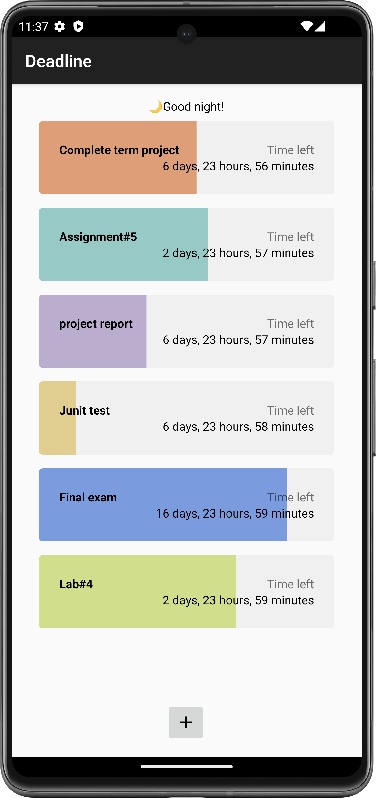


|Title(Essential/Desirable/Optional)<br> |Set New Deadline with Date Picker and Time Picker (Essential)|
|---|---|
|Description|As a user, I want to add a new deadline by selecting the start and end times using date and time pickers, so that I can accurately set the beginning and end points for my tasks.  |
|Mockups|See attached image below |
|Acceptance Tests|Given the user accesses the option to set a new deadline,<br/>When they select the start and end dates and times using the date and time pickers,<br/>Then the deadline with the specified start and end times should be added to their list of deadlines.|
|Test Results| See attached image below |
|Status|Iteration 1: Implemented the UI for adding a new deadline with date and time pickers. <br />Iteration 2: Enabled functionality for selecting start and end times. <br />Iteration 3: Integrated the new deadline addition with the main deadline list. **Completed**. |

<center wdith="100%">
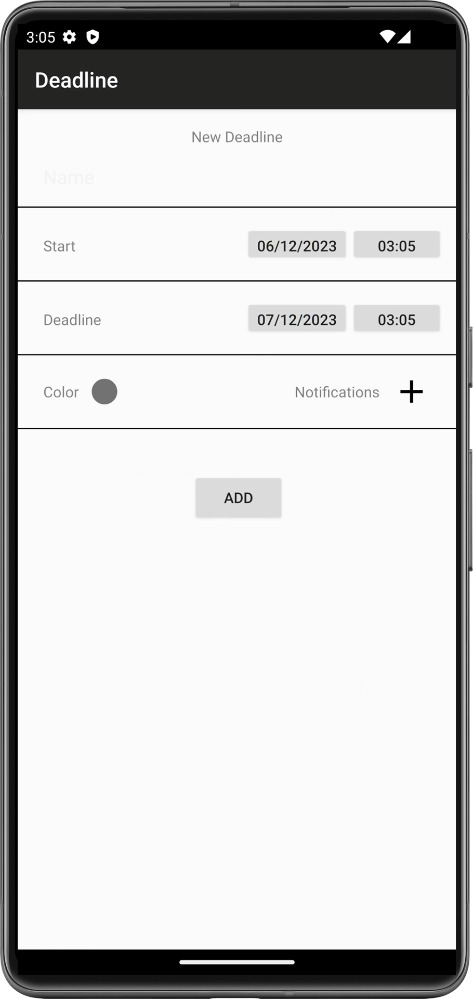
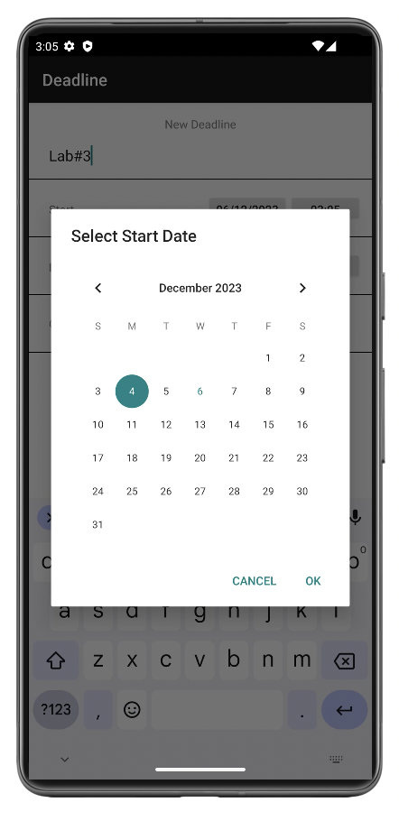
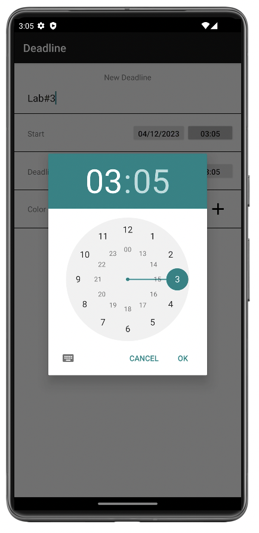
</center>


| Title(Essential/Desirable/Optional)<br> | Set Color Category with Color Picker (Desirable)             |
| --------------------------------------- | ------------------------------------------------------------ |
| Description                             | As a user, I want to select a theme color for each deadline using a color picker, to facilitate Color Categorization and make it easier to visually distinguish and organize my tasks. |
| Mockups                                 | See attached image below                                     |
| Acceptance Tests                        | Given the user is adding or editing a deadline,<br/>When they access the color picker to select a theme color,<br/>Then the selected color should be applied to the deadline item, aiding in visual categorization and organization of tasks. |
| Test Results                            | See attached image below                                     |
| Status                                  | Iteration 1: Implemented UI for color picker within the deadline addition/editing interface. <br />Iteration 2: Enabled functionality for selecting and applying theme colors to deadlines. <br />Iteration 3: Tested and refined color application for visual consistency and user experience. **Completed**. |

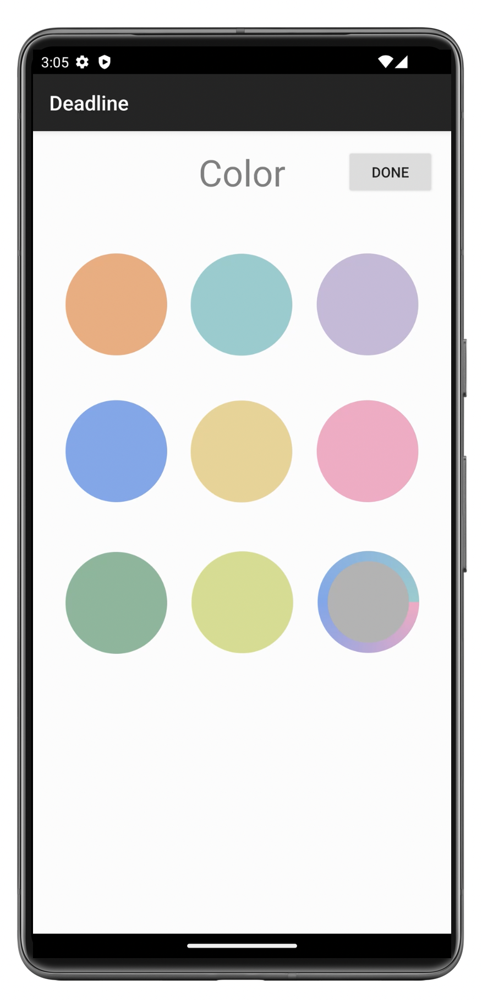


| Title(Essential/Desirable/Optional)<br> | Set Notifications (Desirable)                                |
| --------------------------------------- | ------------------------------------------------------------ |
| Description                             | As a user, I want to set reminders for my deadlines by choosing when to be notified through a notification list picker, so that I can receive alerts at a specific time before each deadline, ensuring I am reminded in advance. |
| Mockups                                 | See attached image below                                     |
| Acceptance Tests                        | Given the user is setting or editing a deadline,<br/>When they access the notification list picker and select a time for the reminder,<br/>Then a notification should be scheduled to alert the user at the chosen time before the deadline. |
| Test Results                            | See attached image below                                     |
| Status                                  | Iteration 1: Implemented the UI for the notification list picker in the deadline setting/editing interface. <br />Iteration 2: Enabled functionality for selecting and scheduling notifications. <br />Iteration 3: Conducted user testing to ensure timely and accurate delivery of notifications. **Completed**. |

<center wdith="100%">
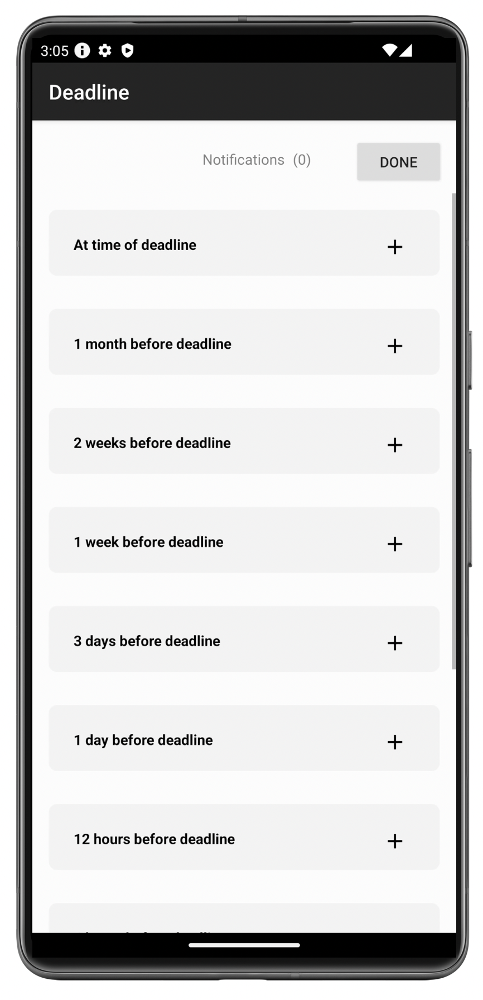
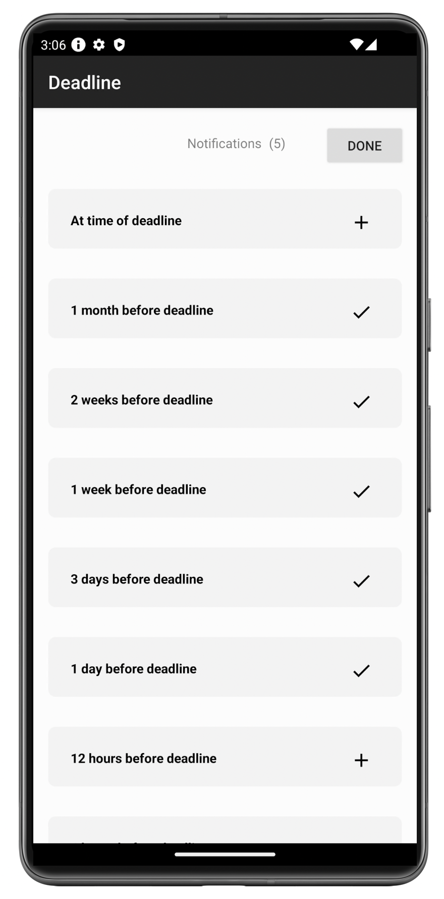
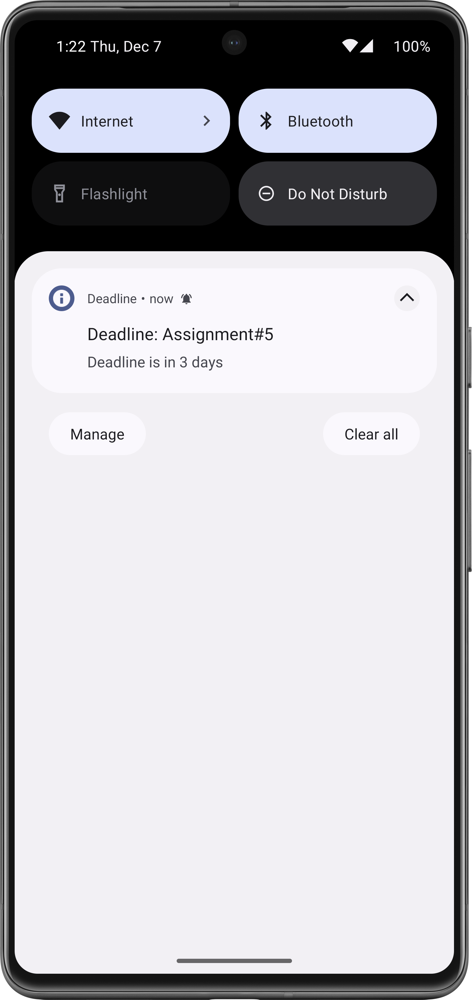
</center>


| Title(Essential/Desirable/Optional)<br> | View Countdown Animation in the Detailed View (Desirable)    |
| --------------------------------------- | ------------------------------------------------------------ |
| Description                             | As a user, I want to see a countdown animation in the detailed view of each deadline, which refreshes every second, to have a dynamic and real-time visual representation of the time remaining until the deadline. |
| Mockups                                 | See attached image below                                     |
| Acceptance Tests                        | Given the user is viewing the detailed page of a specific deadline,<br/>When they observe the countdown animation,<br/>Then the animation should accurately depict the remaining time, updating every second to ensure a real-time countdown until the deadline. |
| Test Results                            | See attached image below                                     |
| Status                                  | Iteration 1: Implemented the UI for the countdown animation in the detailed view of a deadline. <br />Iteration 2: Developed the functionality for the countdown to refresh every second. <br />Iteration 3: Tested for accuracy and reliability in time representation. **Completed.** |

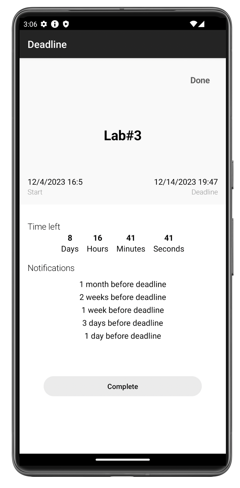

| Title(Essential/Desirable/Optional) | Edit Existing Deadlines with the Edit View (Essential)       |
| ----------------------------------- | ------------------------------------------------------------ |
| Description                         | As a user, I want to be able to modify existing deadlines in the Edit View, including their names, start times, deadline times, colors, and notification times, to ensure my tasks are up to date and accurately reflect my current priorities and schedules. |
| Mockups                             | See attached image below                                     |
| Acceptance Tests                    | Given the user selects an existing deadline to edit,<br/>When they modify the deadline's name, start time, deadline time, color, or notification time in the Edit View,<br/>Then these changes should be saved and reflected in the deadline's representation in the main list. |
| Test Results                        | See attached image below                                     |
| Status                              | Iteration 1: Implemented the basic UI for the Edit View, allowing changes to deadline names and times. <br />Iteration 2: Added functionality to modify the color and notification settings of deadlines. <br />Iteration 3: Conducted extensive testing to ensure changes are saved and correctly reflected in the app. **Completed.** |

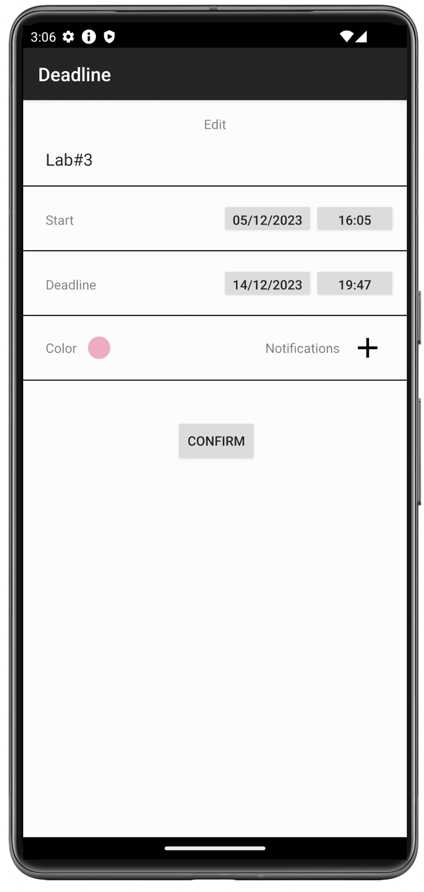


| Title(Essential/Desirable/Optional) | Mark Deadlines as Completed (Essential)                      |
| ----------------------------------- | ------------------------------------------------------------ |
| Description                         | As a user, I want to be able to mark deadlines as completed once I finish the tasks associated with them. Upon marking them as completed, these tasks should be hidden in the list view to keep the focus on pending tasks and declutter the interface. |
| Mockups                             | See attached image below                                     |
| Acceptance Tests                    | Given the user has completed a task associated with a deadline,<br/>When they mark this deadline as completed,<br/>Then the deadline should be hidden or marked distinctly in the list view, indicating its completion and removing it from the list of active tasks. |
| Test Results                        | See attached image below                                     |
| Status                              | Iteration 1: Developed the functionality to mark deadlines as completed. <br />Iteration 2: Implemented the feature to hide or visually distinguish completed deadlines in the list view. <br />Iteration 3: Tested for usability and reliability in updating the list view upon marking tasks as completed. **Completed.** |

<center wdith="100%">
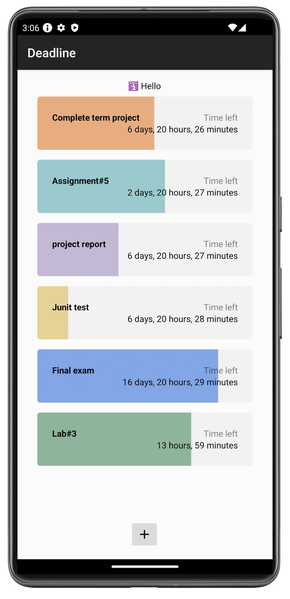
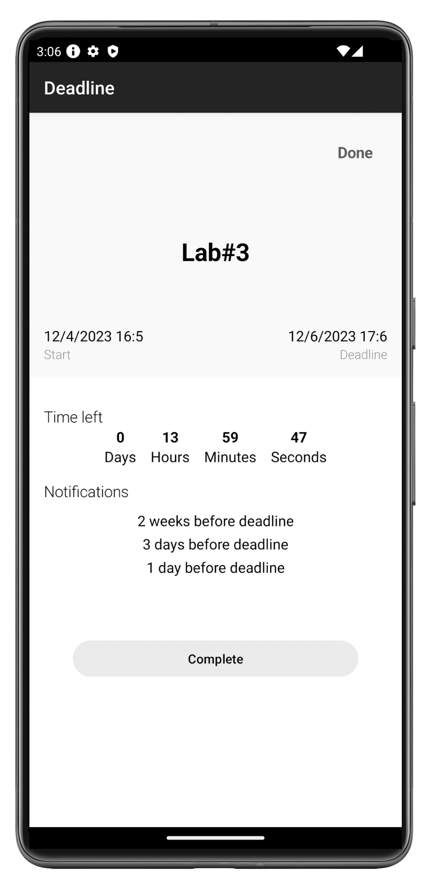
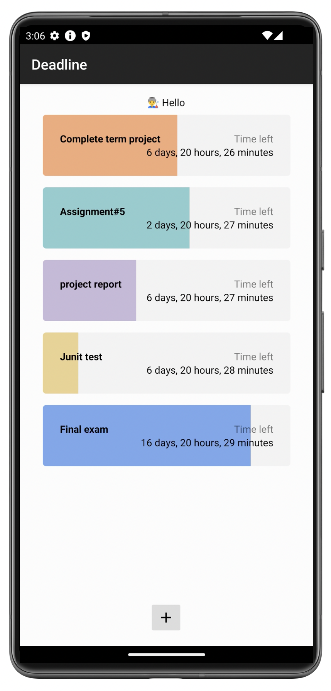
</center>


| Title(Essential/Desirable/Optional) | Add Home Screen Widgets (Essential)                          |
| ----------------------------------- | ------------------------------------------------------------ |
| Description                         | As a user, I want the ability to add home screen widgets that display the most urgent deadlines. This feature will allow for quick and convenient access to my prioritized tasks directly from the home screen, ensuring that I am constantly reminded of and can easily view my impending deadlines. |
| Mockups                             | See attached image below                                     |
| Acceptance Tests                    | Given the user has active deadlines in the application,<br/>When they add a home screen widget,<br/>Then the widget should display the most urgent deadlines, updating in real-time as deadlines approach or are added/edited within the app. |
| Test Results                        | See attached image below                                     |
| Status                              | Iteration 1: Designed and implemented the initial layout for the home screen widgets. <br />Iteration 2: Enabled real-time updating of deadlines within the widgets based on app data. <br />Iteration 3: Conducted user experience testing to ensure widgets are visually appealing and functionally effective. **Completed.** |

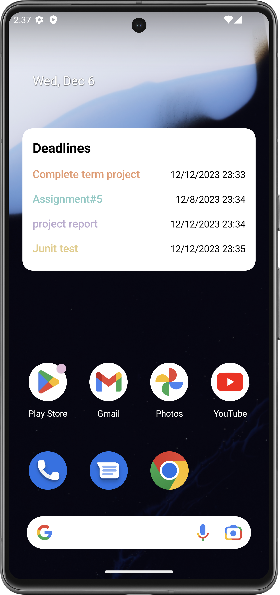


## Design and Implementation

### MVVM Design

The application should be based on the model–view–viewmodel (MVVM) architectural pattern. The app’s user interface would consist of a single activity featuring a list of tasks and countdown timers. The main Android features used would be Recycler View for displaying the list of tasks and Alarm Manager for setting up task deadline reminders.

[![](https://mermaid.ink/img/pako:eNq1V01vGjEQ_SurPbVq-AMcKpGlVZGSNCqUExdnPRA3XhvZhhRFyW_veJdFtjO7S9SES4LfvPH4zYfNU15qDvk4LyWzdirYxrBqpTL81CvZNRNqUjqxF-6QPTWI_3zRqjDAHHz6HC3OHTOuXXsOPU2BcSkU_ILyUEpYCnj8btimAuVCxyPT4MYbBMv8SJ9wtnVgAmSPhtd4CklE550kEfqlBuQJMgXrjD6knJFie7FB-4WecN4eo4098VFo5eCvmzmo5iChDHaJ1Lg1-g-irbdle4ZIivVOytbCjrMrsYcpc-zlSlj30gIvwf4bOHmM4tptOcbfQpgj14f3pu-oP1kL_hQ_tORgElUuheIdIIbsxSr0LtEyOMvE3WornNCKDI3ISiSjvWcG-PJ1mYyUdmItSuZdL99WRmT1d9QWRqAfF6KCW1E-xOevoYJJUJwZ7D-pNxEslAVzEmKmnPYVcMcsdJRoT5tFjPIeygfva8mk4NjdpLTfEPlgbUldz-_bUVy7M_XR-jSoVnvMi8-pdazaLnxa4H1yTk8iTEuYmET3qB3bUbkQTkKwbo8DqZXAh0zA9Qjvw_ypetx2wDdBPVgCL7TUpsdtPbVILchKixQJLepJA-YNETIpOyBsz9KAr52b1ztEKedwpqEBC4NGuCqxrEIzoidqxWwn8N3oau6MUBt_nwzyE9HDvYk74eji9-wSW5H_bOKt66en49_j7kjCPNU6OCYkOcLadvm_50Nz3kJXW22hp3GbV0Fd7PRApdsBJw5-p-Zs5wR-j9srugyKKISowbqb2M1DKPEbvS5Ho6-9j8RxhlMXs9g24Csy9Q4YJJE33CCro6wGeVT2U1KfBt5H59NxnO0snOkkfc6FXEpHz0kq7RwKOZpDIin_wGadnMHdKPmJzbJzOEk3hJTODNHK4-Bg2R2OORzFjQP6RvNsauzGHvKLvAJTMcHxZ13do6vc3ePds8rH-C-HNdtJt8pX6hlN2c7p-UGV-XjNpIWL_Pican4JnlYBJdfm-vhb0f95_gf5gJSY?type=png)](https://mermaid.live/edit#pako:eNq1V01vGjEQ_SurPbVq-AMcKpGlVZGSNCqUExdnPRA3XhvZhhRFyW_veJdFtjO7S9SES4LfvPH4zYfNU15qDvk4LyWzdirYxrBqpTL81CvZNRNqUjqxF-6QPTWI_3zRqjDAHHz6HC3OHTOuXXsOPU2BcSkU_ILyUEpYCnj8btimAuVCxyPT4MYbBMv8SJ9wtnVgAmSPhtd4CklE550kEfqlBuQJMgXrjD6knJFie7FB-4WecN4eo4098VFo5eCvmzmo5iChDHaJ1Lg1-g-irbdle4ZIivVOytbCjrMrsYcpc-zlSlj30gIvwf4bOHmM4tptOcbfQpgj14f3pu-oP1kL_hQ_tORgElUuheIdIIbsxSr0LtEyOMvE3WornNCKDI3ISiSjvWcG-PJ1mYyUdmItSuZdL99WRmT1d9QWRqAfF6KCW1E-xOevoYJJUJwZ7D-pNxEslAVzEmKmnPYVcMcsdJRoT5tFjPIeygfva8mk4NjdpLTfEPlgbUldz-_bUVy7M_XR-jSoVnvMi8-pdazaLnxa4H1yTk8iTEuYmET3qB3bUbkQTkKwbo8DqZXAh0zA9Qjvw_ypetx2wDdBPVgCL7TUpsdtPbVILchKixQJLepJA-YNETIpOyBsz9KAr52b1ztEKedwpqEBC4NGuCqxrEIzoidqxWwn8N3oau6MUBt_nwzyE9HDvYk74eji9-wSW5H_bOKt66en49_j7kjCPNU6OCYkOcLadvm_50Nz3kJXW22hp3GbV0Fd7PRApdsBJw5-p-Zs5wR-j9srugyKKISowbqb2M1DKPEbvS5Ho6-9j8RxhlMXs9g24Csy9Q4YJJE33CCro6wGeVT2U1KfBt5H59NxnO0snOkkfc6FXEpHz0kq7RwKOZpDIin_wGadnMHdKPmJzbJzOEk3hJTODNHK4-Bg2R2OORzFjQP6RvNsauzGHvKLvAJTMcHxZ13do6vc3ePds8rH-C-HNdtJt8pX6hlN2c7p-UGV-XjNpIWL_Pican4JnlYBJdfm-vhb0f95_gf5gJSY)


### Data Persistence					

​				[](https://mermaid.live/edit#pako:eNqVVU2P2jAQ_SuRT6CGKBvCx0YIqVrUU1etlqqHiotJBurKsZE92S6l8NvrAAaHJNtdX5LMvHljv2eGHUllBiQhKadazxhdK5ovhGfWMeI9SZnPKNIl1eDtTplyTSZ0qVHRFKfTU3Tvls2AZpwJaCr9IDcgLGA7o7LTdfDSAa4BLUHnQQqEF-zWqF_p7nbtscxjAp0AMuTgzVExsXbCGqnClvA3ljdUZLZda6a5LpVcqnpYSGQrllJkUjTuA6tcLcLLql3m7KBWNAXrl1X4I-fGgC9LDeqZLjkcPjONB8tzODhoJgwIbapjX7res2RZlfWTLJShLbkmFnfT-MLDsqurDqTYZOaoNjEvz22gvndUoNaziu64-UaBnmAjNUOptpVb4urXeimPktV6X_WopW43X9P0tray5a9K_oL0otd3Br8fza-WN27cOVc95OBXBecWoN9jv2P7g8w3HLAsa7f2zY6-YmZFlMpImvzt9VpGQm0G9XrTuqeu4UFwBXiJV2jQVZAj7g3Z_-Ct1K3mug0colMt8UkOKqcsM7P7eA0WBH9CDguSmNcMVrTguCALsTdQWqCcb0VKElQF-OQs72nak2RFuTZRyMoOj-f_g_Lhkw0VP4zcF4z5JsmOvJAkGo6CeNiPwn4UhXF8H_Z9siVJHNyF4d24Hw2jcBiPRoO9T_4cGcLg_rziaBCGg_F4_w_1XwtO)


### Basic Architecture


### UI Design and Implementation

The user interface would primarily be composed of the following components:

- MainActivity: The main activity serves as the primary hub for the application, hosting and managing the various fragments. It handles navigation between different fragments, ensuring a seamless user experience. The main activity is responsible for managing the lifecycle events and coordinating the interactions between fragments.
- DeadlineRecycleViewFragment: This fragment contains a RecyclerView, which displays a list of deadlines. Each entry in the list is a Composable item, displaying the Name, Time Left, and a Progress Bar. The Progress Bar's color is determined by the user's preference. Tapping on an item in the list brings up a PopupMenu, offering options like “Show in Full”, “Mark as Complete”, and “Edit”.
- AddDeadlineFragment: This fragment provides the interface for adding new deadlines. It includes fields to input the deadline name, start and end times, and a color picker for selecting the item's theme color. It also includes a date and time picker to accurately set the deadline’s start and end times, and an option to set the notification reminder.
- EditDeadlineFragment: Similar to the AddDeadlineFragment, this fragment is used to edit existing deadlines. It allows users to modify the deadline's name, start and end times, color, and notification settings. Changes are reflected in real-time in the DeadlineRecyclerViewFragment upon saving.
- DeadlineDetailFragment: This fragment offers a detailed view of a selected deadline. It displays all relevant information such as name, remaining time, and a countdown animation that updates every second. The detailed view also includes a progress visualization showing the elapsed and remaining time.
- SelectColorFragment: This fragment is dedicated to the color categorization feature. It allows users to select a color for categorizing their deadlines, enhancing visual organization and prioritization. The chosen color is then applied to the respective deadline items in the RecyclerView.
- NotificationRecyclerViewFragment: This fragment manages notifications for deadlines. It presents a list view where users can set and customize the timing of notifications for each deadline. The notification settings include options to choose how far in advance users wish to be notified before each deadline.


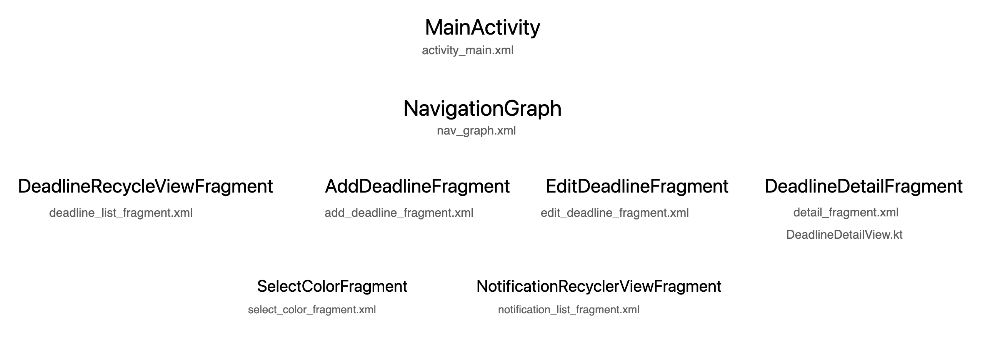


### Other Android Features

We’ll use the Android AlarmManager along with NotificationManager for setting up notifications according to the user-specified time.

#### **System Notification**

Firstly, it is essential to acknowledge the requirement of declaring permission in the `AndroidManifest.xml` file. This declaration is a prerequisite for our application to send system notifications.

```xml
<?xml version="1.0" encoding="utf-8"?>
<manifest xmlns:android="http://schemas.android.com/apk/res/android"
    xmlns:tools="http://schemas.android.com/tools">

    <uses-permission android:name="android.permission.POST_NOTIFICATIONS" />

</manifest>
```

Once the permission requirement is established, the application must programmatically verify if the necessary permissions have been granted. In scenarios where permissions are not already authorized, the application is responsible for initiating a permission request. This step is crucial to ensure compliance with Android's security protocols and to provide a seamless user experience.

```kotlin
if (ActivityCompat.checkSelfPermission(
        context,
        Manifest.permission.POST_NOTIFICATIONS
    ) != PackageManager.PERMISSION_GRANTED
) {
    ActivityCompat.requestPermissions(
        activity,
        arrayOf(Manifest.permission.POST_NOTIFICATIONS),
        1
    )
    return
}
```

Furthermore, the Android notification API employs a builder pattern, which significantly simplifies the process of notification creation. Through this pattern, our application can efficiently construct a notification, encapsulating all necessary details and specifications. Once the notification is crafted, it can be delivered to the system for dissemination.

```kotlin
var builder = NotificationCompat.Builder(context, CHANNEL_ID)
    .setSmallIcon(android.R.drawable.ic_dialog_info)
    .setContentTitle("Notification Title")
    .setContentText("Notification Content")
    .setStyle(
        NotificationCompat.BigTextStyle()
            .bigText("Notification Content")
    )
    .setWhen(timestamp)
    .setPriority(NotificationCompat.PRIORITY_DEFAULT)


with(NotificationManagerCompat.from(context)) {
    notify(1, builder.build())
}

```

This approach not only streamlines the development process but also ensures that the notifications are robust, customizable, and in line with Android's standards. The builder pattern's flexibility allows for a wide range of notification configurations, catering to various user needs and scenarios within our application.


#### Home Screen Widgets

The initial step in this process involves defining a widget receiver within the `AndroidManifest.xml` file. This definition is crucial as it establishes the widget as a component of the application that interacts with the Android system.

```xml
<?xml version="1.0" encoding="utf-8"?>
<manifest xmlns:android="http://schemas.android.com/apk/res/android"
    xmlns:tools="http://schemas.android.com/tools">
    <application>
        <receiver
            android:name="com.example.deadline.widget.MyAppWidgetReceiver"
            android:exported="true">
            <intent-filter>
                <action android:name="android.appwidget.action.APPWIDGET_UPDATE" />
            </intent-filter>
            <meta-data
                android:name="android.appwidget.provider"
                android:resource="@xml/my_app_widget_info" />
        </receiver>
    </application>
</manifest>
```

Accompanying the widget receiver, it is necessary to include metadata that outlines specific properties of the widget. Within this metadata file, several key aspects are defined:

1. **Layout**: This specifies the visual structure and design of the widget, determining how it will appear on the home screen.
2. **Update Cycle**: Here, we establish the frequency at which the widget's content is refreshed or updated, ensuring that the information displayed remains current and relevant.
3. **Widget Category**: This classification helps in identifying the type or nature of the widget, aligning it with the appropriate categorization within the Android ecosystem.

```xml
<appwidget-provider xmlns:android="http://schemas.android.com/apk/res/android"
    android:description="@string/widget_description"
    android:initialLayout="@layout/glance_default_loading_layout"
    android:updatePeriodMillis="60000"
    android:resizeMode="horizontal|vertical"
    android:widgetCategory="home_screen"
    android:widgetFeatures="reconfigurable|configuration_optional">
</appwidget-provider>
```

For the construction of the widget's content, we utilize Jetpack Glance. Jetpack Glance's syntax bears a resemblance to that of Jetpack Compose, thereby providing a familiar framework for developers. However, it's important to note that Jetpack Glance is built upon the Jetpack Compose runtime and offers a more condensed set of features specifically tailored for widget development. This streamlined feature set is optimally designed for creating efficient and effective widgets, striking a balance between functionality and resource utilization.

```kotlin
// MyAppWidgetReceiver.kt
class MyAppWidgetReceiver : GlanceAppWidgetReceiver() {

    // Let MyAppWidgetReceiver know which GlanceAppWidget to use
    override val glanceAppWidget: GlanceAppWidget = MyAppWidget()

    override fun onUpdate(
        context: Context,
        appWidgetManager: AppWidgetManager,
        appWidgetIds: IntArray
    ) {
        super.onUpdate(context, appWidgetManager, appWidgetIds)
    }
}
```

```kotlin
// MyAppWidget.kt
class MyAppWidget : GlanceAppWidget() {

    override suspend fun provideGlance(context: Context, id: GlanceId) {
        provideContent {
            // create your AppWidget here
            MyContent()
        }
    }
}
```


### **Third-party APIs**

#### `com.vdurmont.emoji.EmojiManager`

>*The missing emoji library for java.*
>
>**emoji-java** is a lightweight java library that helps you use Emojis in your java applications

Using for dynamically generating different greeting messages for each rendering.


#### `Calendar`

```kotlin
    val calendar = Calendar.getInstance()
    calendar.time = currentDate  
    calendar.add(Calendar.HOUR_OF_DAY, 24)  
```


#### `com.github.Dhaval2404:ColorPicker:2.3`

> Yet another Color Picker Library for Android. It is highly customizable and easy to use. Pick the color from wheel or select Material Colors from dialog. 

- Color Picker View
- Color Picker Dialog with Recent Color Option
- Material Color Picker Alert Dialog
- Material Color Picker BottomSheet Dialog


### Data Design and Implementation

Data storage will be handled using Room - a Jetpack persistence library that provides an abstraction layer over SQLite, perfect for local database storage. The data class Deadline would look something like this:

```kotlin
@Entity
@TypeConverters(Converters::class)
@Parcelize
data class Deadline(
    @PrimaryKey(autoGenerate = true) val id: Int? = null,
    val title: String,
    val start: String,
    val startTime: String,
    val deadline: String,
    val deadlineTime: String,
    val color: String,
    val notification: String,
    var state: String
) : Parcelable
```


### **Algorithms:**

#### TimSort algorithm

In the implementation of the notification display functionality within our application, we have employed the `sortedByDescending` method, a powerful sorting utility provided by the Kotlin standard library. This method is instrumental in organizing our collection of notifications in a descending order, ensuring that they are arranged based on a specified attribute. In our case, the sorting is conducted on the `offset` property of each notification.

The underlying sorting algorithm utilized by `sortedByDescending` is predominantly the TimSort algorithm, renowned for its efficiency and stability. TimSort is a hybrid sorting algorithm, ingeniously blending the principles of merge sort and insertion sort. It is particularly adept at handling real-world data, offering significant performance advantages, especially in scenarios involving large datasets or complex sorting criteria.

```kotlin
private val _allNotifications = MutableLiveData(NotificationTime.values().toList().sortedByDescending { it.offset }.map { Notification(it, false) })
var allNotifications: MutableLiveData<List<Notification>> = _allNotifications
```

In our application, the sorting process begins by converting the enumeration values of `NotificationTime` into a list. This list is then sorted in a descending order with respect to the `offset` values of each notification. The final step involves mapping these sorted elements into `Notification` objects, thereby creating an organized and prioritized sequence of notifications based on their respective time offsets. This methodical arrangement plays a pivotal role in ensuring that the notifications are displayed in an order that emphasizes their relative urgency and timing, significantly enhancing the user's ability to quickly comprehend and respond to them.


## Project Structure

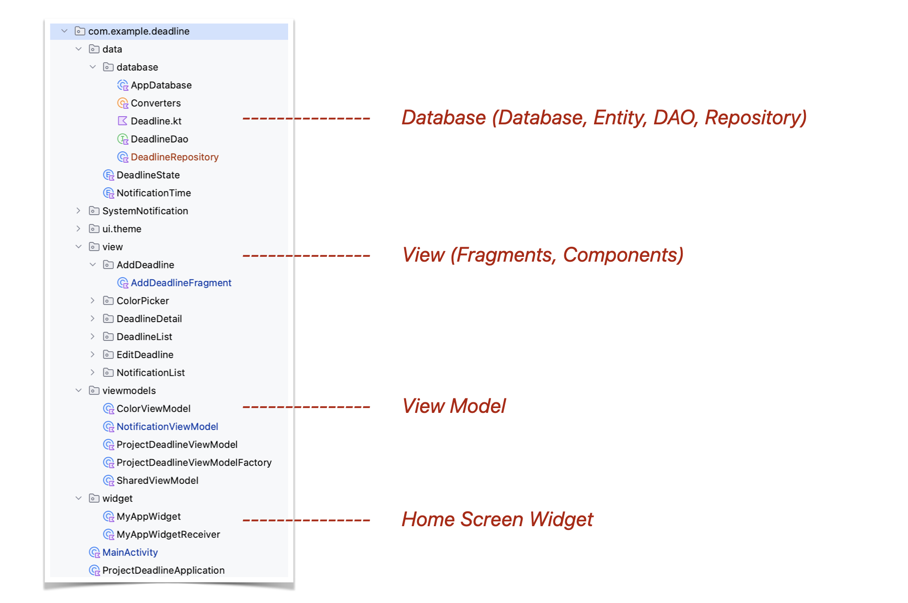                              
